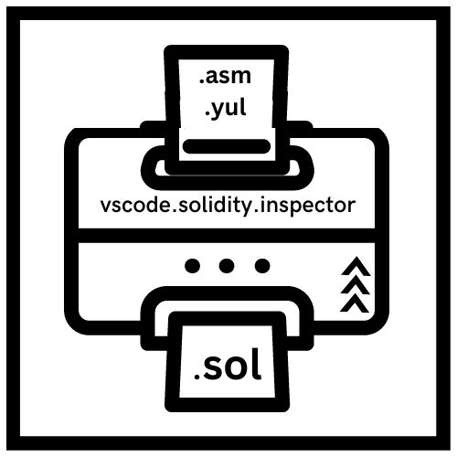
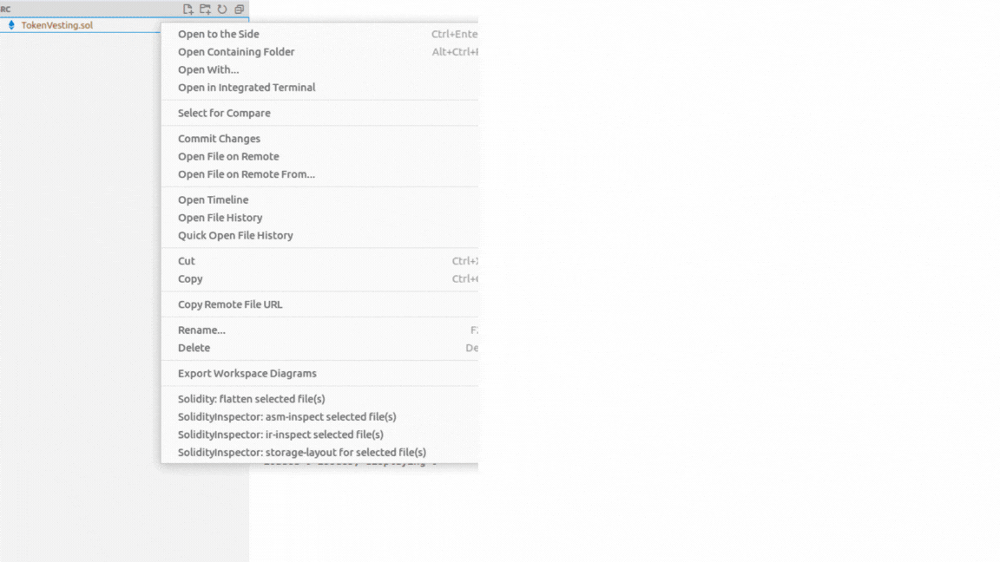
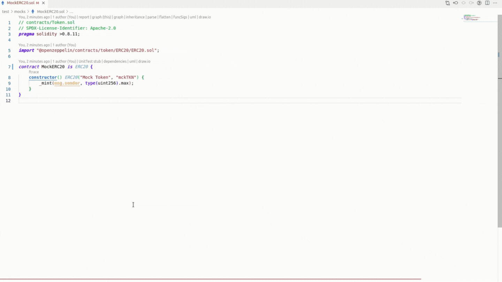
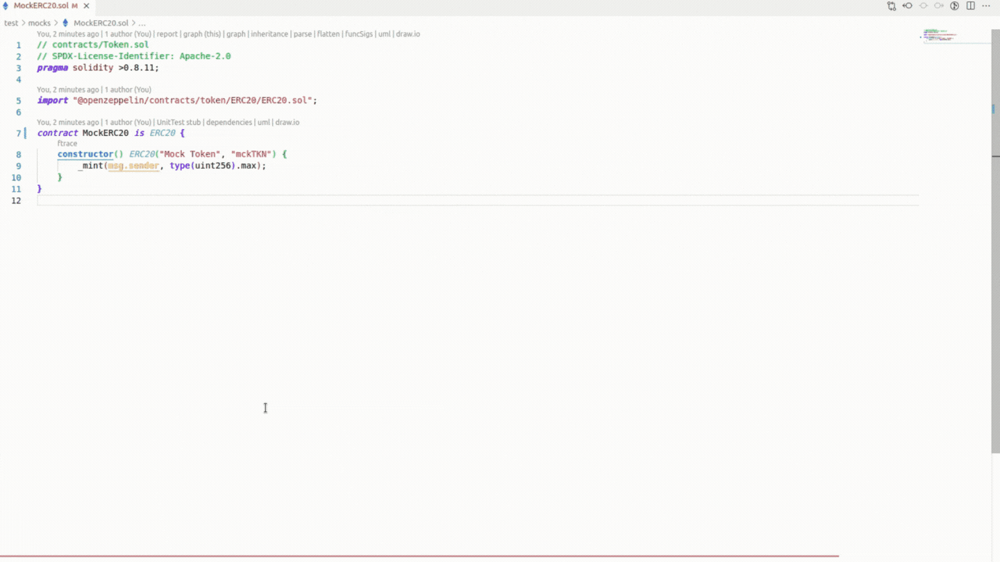

# VSCode Solidity Inspector • 

An extension for VSCode editor to inspect the Solidity smartcontracts and generate yul/asm outputs to inspect what's happening under-the-hood. Read 0age's [tweet](https://twitter.com/z0age/status/1578443876615929857), it is the inspiration for this extension.

> Note: This extension is not tested across multiple platforms yet.Only the contracts under foundry project are supported for now.

---

## Motivation:

0age 👑 dropped the optimization alpha in his tweet and when I tried it out for the first time it was really a cool trick. The tweet has the configuration for hardhat projects. But forge helps to do the same thing in a single command. So I thought instead of typing out the command for each contracts, it would be handy for the buildoors if there's an extension to inspect solidity contracts and generate low-level code for the contracts. The o/p generated is very useful for gas optimizations.

TL;DR, this is my first VSCode extension, so feel free to provide feedback as I know that there's a plenty of room for improvements, as always^^

### Features at a glances:

- Forge ir-optimized o/p generation for the current file.
- Forge ir-optimized o/p generation for the multiple files option via the context menu.
- Forge asm-optimized o/p generation for the current file.
- Forge asm-optimized o/p generation for the multiple files option via the context menu.

---

## Getting Started

### Requirements

The following will need to be installed in order to use this template. Please follow the links and instructions.

- [Foundry / Foundryup](https://github.com/gakonst/foundry)
  - This will install `forge`, `cast`, and `anvil`
  - You can test you've installed them right by running `forge --version` and get an output like: `forge 0.2.0 (f016135 2022-07-04T00:15:02.930499Z)`
  - To get the latest of each, just run `foundryup`

### Usage

The usage of this extension is straightforward. You can inspect the solidity contracts that are under the foundry project in two ways:

1. Select file(s) -> Right click -> `SolidityOptimizer: ir-optimize selected file(s)`
<figure>

<figcaption><b>VSCode File Explorer menu</b>
</figcaption>
</figure>

2. Press `Cmd + Shift + P` -> Search `Solidity Optimizer - ir-optimize`

<figure>

<figcaption align="center"><b>IR-Optimized Output</b>
</figcaption>
</figure>

<figure>

<figcaption align="center"><b>ASM-Optimized Output</b>
</figcaption>
</figure>

<!-- CONTRIBUTING -->

## Contributing

Contributions are welcomed. Any contributions you make are **greatly appreciated**.

1. Fork the Project
2. Create your Feature Branch (`git checkout -b feature/AmazingFeature`)
3. Commit your Changes (`git commit -m 'Add some AmazingFeature'`)
4. Push to the Branch (`git push origin feature/AmazingFeature`)
5. Open a Pull Request

## Disclaimer

_The outputs generated are not always safe for production usage. No guarantee, representation or warranty is being made, express or implied, as to the safety or correctness of the result. They have not been audited and as such there can be no assurance they will work as intended, and users may experience delays, failures, errors, omissions, loss of transmitted information or loss of funds. The creators are not liable for any of the foregoing. Users should proceed with caution and use at their own risk._
