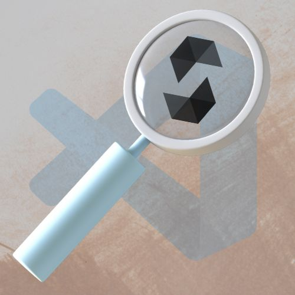

# VSCode Solidity Inspector • 

An extension for VSCode editor to inspect the Solidity smartcontracts and generate yul/asm outputs to inspect what's happening under-the-hood. Read 0age's [tweet](https://twitter.com/z0age/status/1578443876615929857), it is the inspiration for this extension.

> Note: This extension is not tested across multiple platforms yet.Only the contracts under foundry project are supported for now.

---

## Motivation:

0age 👑 dropped the optimization alpha in his [tweet](https://twitter.com/z0age/status/1578443876615929857) and when I tried it out for the first time I thought it was really a cool trick. The tweet has the configuration only for hardhat projects. But forge helps to do the same thing in a single command. So I thought instead of typing out the command for each contract in the CLI, it would be handy for the buildooors if there's an extension to inspect solidity contracts and generate low-level code for the contracts. The o/p generated is very useful for gas optimizations.

TL;DR, this is my first VSCode extension, so feel free to provide feedback as I know that there's a plenty of room for improvements, as always^^

### Features at a glance:

- Forge ir-optimized o/p generation for the current file (or) selected file(s).
- Forge asm-optimized o/p generation for the current file (or) selected file(s).
- Forge storage-layout o/p generation for the current file (or) selected file(s).
- Flatten current file (or) selected file(s).
- Inline highlighting in code editor for unused imports.
- Generate and view Foundry deployment report in a clean and concise table format. 
- Syntax highlighting of for `.tree` files.
- Generate foundry test stub using [bulloak](https://github.com/alexfertel/bulloak)'s `scaffold` command. 

---

## Requirements

The following will need to be installed in order to use this template. Please follow the links and instructions.

- [Foundry / Foundryup](https://github.com/gakonst/foundry)
  - This will install `forge`, `cast`, and `anvil`
  - You can test you've installed them right by running `forge --version` and get an output like: `forge 0.2.0 (f016135 2022-07-04T00:15:02.930499Z)`
  - To get the latest of each, just run `foundryup`

- [Bulloak](https://github.com/alexfertel/bulloak)
  - This is required to generate test stub from `.tree` spec files.
 
 ---

## Usage

The usage of this extension is straightforward.

- From the context menu: Select file(s) -> Right click -> `SolidityInspector: <ACTION>`
- From the command pallet: Press `Cmd + Shift + P` -> Search `Solidity Inspector - <ACTION>`

---

#### Highlights unused imports:

https://github.com/PraneshASP/vscode-solidity-inspector/assets/42379522/e4906ad3-69e6-4cea-b986-7712ec342fca

---

#### Generate foundry deployment report:

https://github.com/PraneshASP/vscode-solidity-inspector/assets/42379522/cfaf987e-ad91-4927-9042-7562bc8684dc

---

#### Support for `.tree` files and test stub generation: 

https://github.com/PraneshASP/vscode-solidity-inspector/assets/42379522/2a3d591b-bc80-46cc-88c9-7e4faa0bb043

---

> For more demos, see [./assets](https://github.com/PraneshASP/vscode-solidity-inspector/tree/main/assets)

<!-- CONTRIBUTING -->

## Contributing

Contributions are welcomed. Any contributions you make are **greatly appreciated**.

1. Fork the Project
2. Create your Feature Branch (`git checkout -b feature/AmazingFeature`)
3. Commit your Changes (`git commit -m 'Add some AmazingFeature'`)
4. Push to the Branch (`git push origin feature/AmazingFeature`)
5. Open a Pull Request

## Disclaimer

_The outputs generated are not always safe for production usage. No guarantee, representation or warranty is being made, express or implied, as to the safety or correctness of the result. They have not been audited and as such there can be no assurance they will work as intended, and users may experience delays, failures, errors, omissions, loss of transmitted information or loss of funds. The creators are not liable for any of the foregoing. Users should proceed with caution and use at their own risk._
